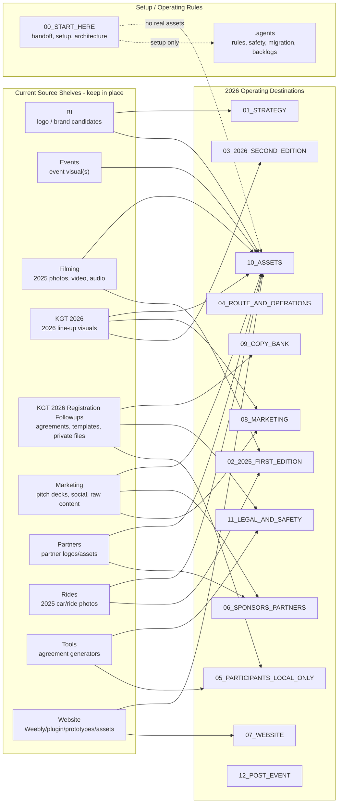

# Workspace Migration Map

Created: 2026-05-26

This is a planning map only. It does not authorize moving, deleting, renaming, or committing files.

## Current Principle

Old folders are source shelves. Numbered folders are 2026 operating destinations. Real migration happens only after an asset index and explicit approval.

## Visual Map



## GitHub Safety Legend

| Status | Meaning |
|---|---|
| `GitHub-safe-now` | Can be considered for first commit after final staged-file review |
| `Review-before-GitHub` | May be committed later if public-safe and 2026-relevant |
| `Local-only-private` | Never commit unless Francois explicitly overrides |
| `Local-only-heavy` | Keep out of GitHub by default because of size/raw media |
| `Website-social-candidate` | May be committed later if optimized, public-safe, and needed |
| `Legacy-reference` | Useful for 2026 proof/context, but not automatically part of 2026 repo |

## Migration Table

| Current source | What it appears to contain | Proposed operating destination | Privacy / GitHub status | Action now |
|---|---|---|---|---|
| `00_START_HERE/` | Setup docs, handoff, guides, approval/GitHub docs | Keep in `00_START_HERE/` | `GitHub-safe-now` after review | Keep setup-only |
| `00_START_HERE/01_ASSETS/` | Setup asset templates/exports folder | Keep as setup-only or rename later after review | `Review-before-GitHub` | Do not place real KGT assets here |
| `.agents/` | Agent rules, safety reports, backlogs | Keep in `.agents/` | `GitHub-safe-now` after review | Keep |
| `BI/` | Brand/logo image candidates | `10_ASSETS/brand/` and `01_STRATEGY/visual_identity_WORKING.md` | `Review-before-GitHub` | Index first; identify latest logo |
| `Events/` | Event visual(s) | `10_ASSETS/event_visuals/` or `08_MARKETING/` | `Review-before-GitHub` | Index first |
| `Filming/` | 2025 photos, videos, narration, music | `02_2025_FIRST_EDITION/` for index; selected assets to `10_ASSETS/` | `Local-only-heavy`; selected exports may be `Website-social-candidate` | Do not move; build media index |
| `KGT 2026/Line up phase 1/` | 2026 line-up visuals and car visuals | `03_2026_SECOND_EDITION/lineup/`, `08_MARKETING/registered_car_lineup.md`, selected media in `10_ASSETS/2026_lineup/` | `Review-before-GitHub`; some may be `Website-social-candidate` | Index and privacy-check plates/names |
| `KGT 2026 Registration Followups/private_participant_files/` | Private participant agreements/files | `05_PARTICIPANTS_LOCAL_ONLY/private/` if migrated later | `Local-only-private` | Do not move or commit |
| `KGT 2026 Registration Followups/templates/` | Agreement/email/SMS/next-step templates | `05_PARTICIPANTS_LOCAL_ONLY/` or `09_COPY_BANK/participant_messages/` after redaction | `Review-before-GitHub`; templates may be safe if redacted | Review before reuse |
| `Marketing/Pitch Deck/` | Sponsor pitch decks and visuals | `06_SPONSORS_PARTNERS/decks/` and `10_ASSETS/sponsor_deck_assets/` | `Review-before-GitHub` | Review for private sponsor info and actual vs projection claims |
| `Marketing/Social Media/` | Instagram, YouTube, memes, raw content | `08_MARKETING/` plus selected assets in `10_ASSETS/social/` | Raw is `Local-only-heavy`; selected exports may be `Website-social-candidate` | Index by campaign and 2026 relevance |
| `Marketing/Social Media/Raw content/` | Raw social source material | Usually keep local | `Local-only-heavy` | Do not commit |
| `Partners/` | Partner logos/assets | `06_SPONSORS_PARTNERS/partner_assets/` and `10_ASSETS/partners/` | `Review-before-GitHub` | Confirm partner status before public use |
| `Rides/` | 2025 participant/ride photos | `02_2025_FIRST_EDITION/rides_index.md`; selected public-safe assets to `10_ASSETS/2025_reference/` | `Legacy-reference`; review plates/privacy | Index first, no move |
| `Tools/KGT Agreement Tools/` | Agreement generation scripts | `05_PARTICIPANTS_LOCAL_ONLY/tools/` or `11_LEGAL_AND_SAFETY/agreement_tools/` | `Review-before-GitHub`; may touch private docs | Review scripts before commit |
| `Website/Sites - All images/Route/` | Route images including full route draft | `07_WEBSITE/route_pages/` and `04_ROUTE_AND_OPERATIONS/` | `Review-before-GitHub`; unrevealed route risk | Keep local until reveal scope approved |
| `Website/Weebly Site Editor Plugin/` | Website plugin/tooling, backups, credentials | `07_WEBSITE/weebly_workflow/` only after credential cleanup | Credentials `Local-only-private`; code `Review-before-GitHub` | Do not commit credentials/backups |
| `Website/kgt-freeform/` | Website prototype/export with assets | `07_WEBSITE/prototypes/kgt-freeform/` if needed | `Review-before-GitHub`; media size/privacy review | Review before commit |
| `Website/kgt-reimagined/` | Website concept, assets, motion, Weebly paste | `07_WEBSITE/prototypes/kgt-reimagined/` if needed | `Review-before-GitHub`; media size/privacy review | Review before commit |
| Root `코리아 그랜투어_서명.pdf` | Korean signed/signature-looking PDF | `05_PARTICIPANTS_LOCAL_ONLY/private/` if migrated later | `Local-only-private` until identified | Do not commit |
| Root `istockphoto-1431176960-612x612.jpg` | Stock image | `10_ASSETS/reference/` only if licensed/needed | `Review-before-GitHub` | Verify license/usefulness |

## Proposed Future Structure For 2026 Repo

```text
Korea Grand Tour/
|-- 00_START_HERE/
|-- .agents/
|-- 01_STRATEGY/
|-- 03_2026_SECOND_EDITION/
|-- 04_ROUTE_AND_OPERATIONS/
|-- 06_SPONSORS_PARTNERS/
|-- 07_WEBSITE/
|-- 08_MARKETING/
|-- 09_COPY_BANK/
|-- 10_ASSETS/
|   |-- brand/
|   |-- 2026_lineup/
|   |-- website_social_ready/
|   |-- exports/
|-- 11_LEGAL_AND_SAFETY/
|-- 12_POST_EVENT/
```

`02_2025_FIRST_EDITION/` can exist in the 2026 repo only as public-safe proof/reference. It should not become a full 2025 archive.

`05_PARTICIPANTS_LOCAL_ONLY/` can exist locally, but its private contents should stay ignored and out of GitHub.

## Recommended Asset Index Fields

Use these fields for the next read-only index:

| Field | Purpose |
|---|---|
| `current_path` | Where the file lives now |
| `asset_type` | photo, video, deck, logo, route, website, template, private doc, etc. |
| `edition_relevance` | 2026, 2025-reference, general, unknown |
| `privacy_status` | public-safe, internal, local-only-private, needs-review |
| `github_status` | safe-now, review-before-github, local-only-private, local-only-heavy |
| `suggested_destination` | Proposed numbered folder path |
| `migration_priority` | high, medium, low, defer |
| `approval_needed` | yes/no |
| `notes` | plates, names, route leak, sponsor status, size, duplicate signal |

## Recommended Migration Phases

### Phase 0 - Now

- Keep old folders in place.
- Maintain setup docs.
- Protect private and heavy files with `.gitignore`.
- Do not push yet.

### Phase 1 - Read-Only Index

- Build indexes for top-level folders.
- Classify files without moving them.
- Identify GitHub-safe docs and 2026-only candidates.

### Phase 2 - First Private GitHub Commit

- Commit only safe operating docs and 2026 context files.
- Exclude raw media, private docs, credentials, and unrevealed route details.

### Phase 3 - Reviewed 2026 Asset Selection

- Select compressed website/social-ready assets.
- Check privacy, plates, route leaks, and file size.
- Commit only approved optimized assets.

### Ongoing Asset Creation Rule

- Every new KGT 2026 Instagram, YouTube, website, sponsor/public, or official communication asset should be saved in the relevant local folder.
- Public-safe finished/source assets should also be added to GitHub so the 2026 repo remains useful and current.
- Prefer `10_ASSETS/website_social_ready/`, `10_ASSETS/exports/`, `08_MARKETING/`, `07_WEBSITE/`, or `06_SPONSORS_PARTNERS/` depending on the use case.
- Keep raw working footage/media local unless it is intentionally selected, optimized, and approved for GitHub.

### Phase 4 - Optional Physical Migration

- Move selected files only after the migration map is approved.
- Keep an old-path to new-path record.
- Do not move private participant materials without a specific reason.

## Decisions Still Needed

- Which file is the latest official logo?
- Which 2026 line-up visuals are approved for public use?
- Which website prototype is the active direction, if any?
- Whether `02_2025_FIRST_EDITION/` should enter the 2026 repo as proof/reference.
- Whether agreement tools should be kept local-only or committed after redaction.
- Whether root Korean PDF is private/signature-related and should be moved local-only later.
